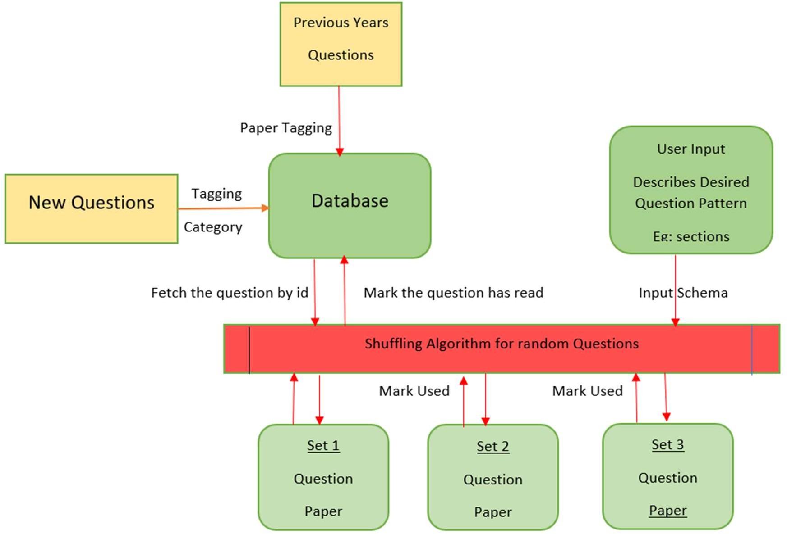
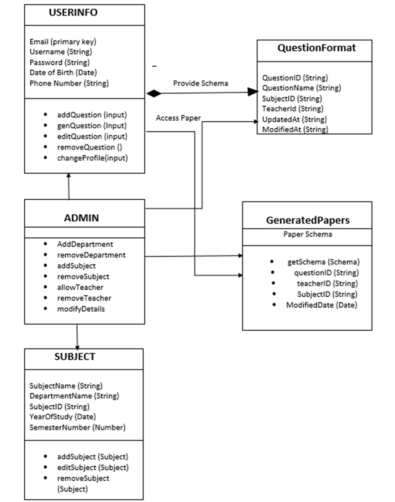
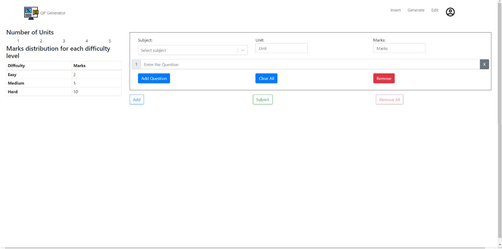
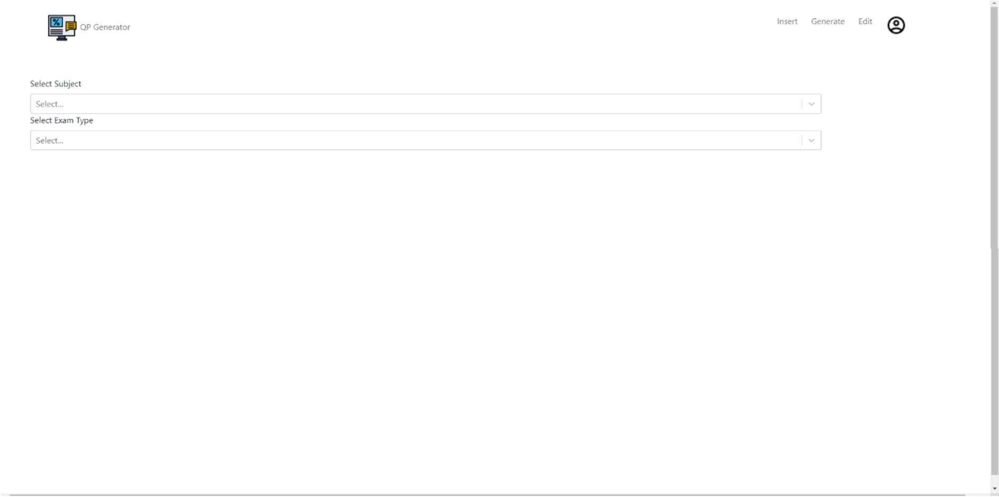
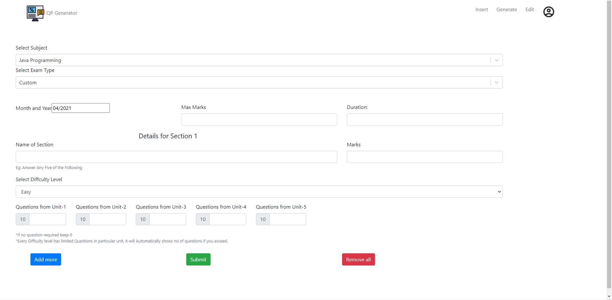

# Question Paper Generator

> **An automated web application to create randomized, formatted question papers**  
> Built with a React frontend and Python backend, this tool lets subject experts input questions (by unit & difficulty), then generates PDF papers (Mid‐term, Semester or Custom) with no repeats and full schema control.

---

## 📋 Table of Contents

- [Features](#features)  
- [Tech Stack](#tech-stack)  
- [Architecture & Class Diagram](#architecture--class-diagram)  
- [Getting Started](#getting-started)  
- [Screenshots](#screenshots)  
- [License](#license)  

---

## 🌟 Features

- **Authentication & Authorization**  
  - Email-verification gated sign-up  
  - Admin role for managing departments & subjects  

- **Question Management**  
  - Batch‐insert questions with unit & difficulty tags  
  - View → Edit → Delete only your own questions  

- **Paper Generation**  
  - **Predefined schemas**: Mid-term & Semester formats  
  - **Custom schema**: Sections, marks, unit allocations & difficulty per section  
  - Randomization via Fisher-Yates shuffle to avoid repeats  

- **Output**  
  - Downloadable PDF formatted to your schema  
  - Unique question papers every time  

---

## 🛠️ Tech Stack

| Layer       | Technology                        |
| ----------- | --------------------------------- |
| Frontend    | React, React-Select, CSS/HTML     |
| Charts & PDF| jsPDF (or Puppeteer)              |
| Backend     | Python, FastAPI (or Flask), Pandas |
| Database    | PostgreSQL (or MongoDB)           |
| Deployment  | Docker, GitHub Actions → AWS/GCP  |

---

## 🏛️ Architecture & Class Diagram

***System Architecture***

***Class Diagram***

***Insert Question Screen***

***Generate Question***

***Generate Custom Paper***

---